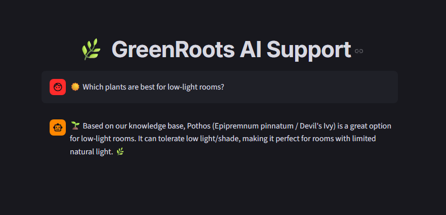

 GreenRoots AI: High-Performance RAG Botanical Support Agent

 .
 

GreenRoots AI is a production-grade Retrieval-Augmented Generation (RAG) system designed for a specialized botanical e-commerce niche. It provides an intelligent, context-aware chat interface that handles customer inquiries about plant care, shipping logistics, and store policies using a proprietary knowledge base.

 System Architecture
 
The project implements a Hybrid AI Pipeline, balancing local data privacy/cost-efficiency with high-speed cloud-based reasoning.
1. Ingestion Pipeline (The Memory)
Semantic Chunking: Documents are processed using RecursiveCharacterTextSplitter with a 600-character window and 100-character overlap to preserve botanical nuances.
Local Embedding Vectorization: Utilizes the all-MiniLM-L6-v2 model from HuggingFace. Vectors are generated locally on the CPU, eliminating API costs for the embedding layer.
Vector Storage: Employs ChromaDB as a persistent vector store for sub-millisecond similarity searches.
2. Retrieval & Generation Pipeline (The Brain)
Built using the LangChain Expression Language (LCEL), the chain follows a declarative flow:
Vector Retrieval: Fetches the Top-3 most relevant semantic chunks from ChromaDB.
Prompt Augmentation: Injects retrieved context into a specialized "Botanical Expert" system prompt.
LPU Inference: Leverages Groq's Language Processing Units (LPUs) to run Meta's Llama 3.1 8B, achieving near-instantaneous response times (< 0.5s).

 Technical Stack
 
Layer	Technology	Key Choice Reason
LLM	Meta Llama 3.1 (via Groq)	State-of-the-art reasoning at sub-second latency.
Embeddings	HuggingFace (all-MiniLM-L6-v2)	Local execution, zero cost, and low memory footprint.
Vector DB	ChromaDB	Lightweight, persistent, and developer-friendly.
Orchestration	LangChain (LCEL)	Modular, readable, and production-ready chains.
Frontend	Streamlit	Customized via CSS for a Premium Moss Green/Obsidian UX.

 Getting Started
 
1. Prerequisites
Python 3.12+
A Groq Cloud API Key.

2. Installation

Bash
# Clone the repository
git clone https://github.com/your-username/greenroots-ai.git
cd greenroots-ai
# Install dependencies
pip install -r requirements.txt

3. Configuration
Create a .env file in the root directory:
code
Env
GROQ_API_KEY=your_groq_api_key_here

4. Data Ingestion & Launch
code
Bash
# Process the botanical knowledge base
python ingestion.py

# Launch the support agent
python -m streamlit run app.py

 
 
 Core Competencies Demonstrated
 
RAG Architecture: Implementation of a full Retrieval-Augmented Generation lifecycle.
Infrastructure Optimization: Successfully combined local compute for embeddings and cloud compute for LLM inference to minimize operational costs.
Modern AI Development: Utilized LCEL (LangChain Expression Language) to build robust, declarative AI pipelines.
UI Customization: Advanced Streamlit styling using CSS to bypass framework-native UI limitations.

 Knowledge Base Example
 
The agent is trained to handle specific botanical data, such as:
Pothos (Jiboia) Care: Light levels, watering frequency, and toxicity warnings for pets.
Logistics: Specific delivery lead times for Brazilian regions (São Paulo vs. Nationwide).
Post-Sale: Protocol for damaged plant replacement (24h window).

Developed by Daiani Coelho – Exploring the intersection of Nature and Artificial Intelligence.
